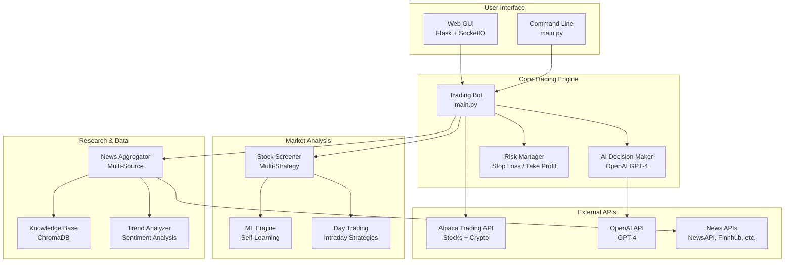
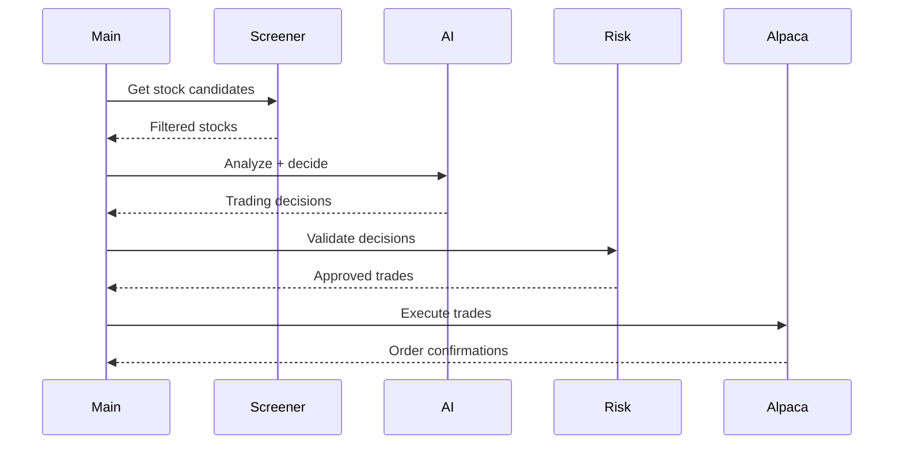
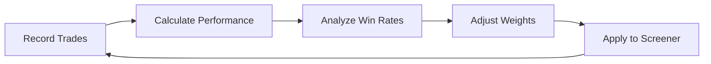
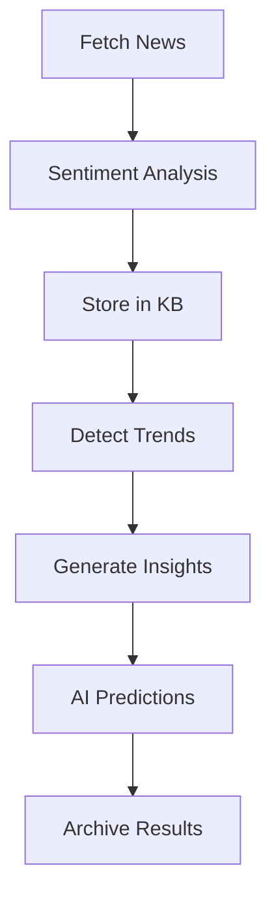
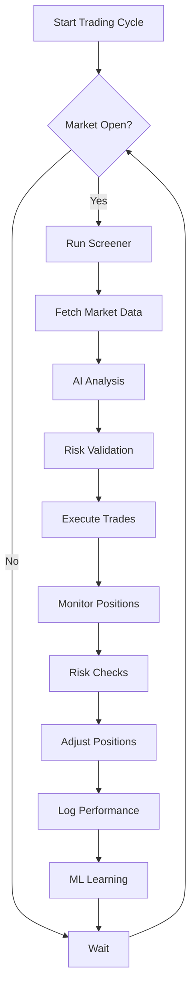
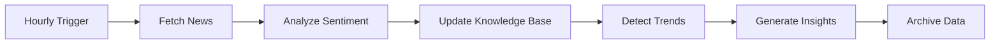

# GJ AI Trading Bot - Architecture Documentation

## System Overview

The GJ AI Trading Bot is a modular, AI-powered trading system that combines machine learning, real-time market analysis, and risk management to execute automated trading strategies on the Alpaca platform.

---

## High-Level Architecture



---

## Component Architecture

### 1. Trading Bot Core (`main.py`)

**Purpose:** Main orchestration layer that coordinates all components

**Key Functions:**
- `trading_bot()` - Main trading loop
- `make_ai_decisions()` - AI-powered decision making
- `filter_ai_hallucinations()` - Validates AI decisions
- `get_screened_stocks()` - Fetches screened stock candidates
- `get_screened_crypto()` - Fetches crypto candidates

**Flow:**


---

### 2. Stock Screener (`src/screener.py`)

**Purpose:** Multi-strategy stock screening system

**Strategies:**
1. **Momentum** - Price action + volume
2. **Growth** - Revenue/EPS growth
3. **Value** - P/E, P/B ratios
4. **Crypto** - Momentum & reversal

**Universe:**
- S&P 500 stocks
- Russell 2000 sample
- 10 major cryptocurrencies

**Key Features:**
- Dynamic strategy weighting
- ML-based weight adjustment
- Persistent screening results

---

### 3. Risk Manager (`src/risk_manager.py`)

**Purpose:** Portfolio protection and position management

**Features:**
- **Stop Loss:** Default 5% (configurable)
- **Take Profit:** Default 10% (configurable)
- **Daily Loss Limit:** Default 2% (circuit breaker)
- **Position Sizing:** Risk-based calculation

**Safety Mechanisms:**
```python
# Circuit Breaker
if daily_loss > MAX_DAILY_LOSS:
    halt_trading()

# Position Monitoring
for position in portfolio:
    if loss > STOP_LOSS:
        sell_position()
    elif profit > TAKE_PROFIT:
        sell_position()
```

---

### 4. ML Engine (`src/ml_engine.py`)

**Purpose:** Self-learning system that optimizes strategy weights

**Capabilities:**
- Trade performance tracking
- Strategy win rate calculation
- Automatic weight adjustment
- Linear regression for optimization

**Learning Process:**


---

### 5. Research Bot (`src/research/`)

**Components:**

#### News Aggregator (`news_aggregator.py`)
- Fetches from NewsAPI, Alpha Vantage, Finnhub
- Sentiment analysis with TextBlob
- Request caching

#### Knowledge Base (`knowledge_base.py`)
- ChromaDB vector storage
- Semantic search
- Historical insights

#### Trend Analyzer (`trend_analyzer.py`)
- Emerging trend detection
- Market sentiment analysis
- AI-powered predictions

#### Research Scheduler (`research_scheduler.py`)
- Automated hourly news fetching
- Daily strategy research
- Morning predictions

**Research Workflow:**


---

### 6. API Integrations

#### Alpaca Client (`src/api/alpaca.py`)

**Features:**
- Paper + live trading
- Stock + crypto support
- Historical data fetching
- Technical indicators (RSI, VWAP, MA)

**Methods:**
```python
# Account Management
get_account_info()
get_portfolio_stocks()
get_crypto_positions()

# Trading
buy_stock(symbol, quantity)
sell_stock(symbol, quantity)
buy_crypto(symbol, amount_usd)
sell_crypto(symbol, amount_usd)

# Market Data
get_current_price(symbol)
get_historical_data(symbol, span)
is_market_open()
```

#### OpenAI Client (`src/api/openai.py`)

**Features:**
- GPT-4 integration
- JSON response parsing
- Trading decision generation

**Usage:**
```python
response = make_ai_request(prompt)
decisions = parse_ai_response(response)
```

---

### 7. Web GUI (`gui.py`)

**Technology:** Flask + SocketIO

**Features:**
- Real-time bot control (start/stop)
- Live portfolio monitoring
- Research dashboard
- Day trading dashboard
- WebSocket event streaming

**Endpoints:**
- `/` - Main dashboard
- `/health` - Health check
- WebSocket events for real-time updates

---

## Data Flow

### Trading Cycle



### Research Cycle



---

## Configuration

### Key Settings (`config.py`)

```python
# Trading Mode
MODE = "demo"  # demo, auto, manual

# API Credentials
ALPACA_CONFIG = {
    'api_key': '...',
    'secret_key': '...',
    'paper': True  # Paper trading
}
OPENAI_API_KEY = "..."

# Risk Management
PORTFOLIO_LIMIT = 10
MIN_BUYING_AMOUNT_USD = 1.0
MAX_BUYING_AMOUNT_USD = 10.0
MIN_BUYING_POWER_BUFFER = 50.0

# Research Bot
ENABLE_RESEARCH_BOT = True
NEWS_FETCH_INTERVAL_HOURS = 1
```

---

## Directory Structure

```
GJ AI Trading Bot/
├── main.py                 # Main trading bot
├── gui.py                  # Web interface
├── config.py              # Configuration
├── requirements.txt       # Dependencies
├── src/
│   ├── api/              # API integrations
│   │   ├── alpaca.py    # Alpaca trading
│   │   └── openai.py    # OpenAI GPT
│   ├── data/            # Data fetching
│   │   ├── stock_data.py
│   │   └── intraday_data.py
│   ├── day_trading/     # Day trading strategies
│   │   ├── day_screener.py
│   │   ├── entry_manager.py
│   │   └── stop_loss_manager.py
│   ├── research/        # Research bot
│   │   ├── news_aggregator.py
│   │   ├── knowledge_base.py
│   │   └── trend_analyzer.py
│   ├── utils/           # Utilities
│   │   ├── logger.py
│   │   └── validators.py
│   ├── screener.py      # Stock screener
│   ├── risk_manager.py  # Risk management
│   ├── ml_engine.py     # Machine learning
│   └── trade_journal.py # Trade tracking
├── tests/
│   ├── unit/            # Unit tests
│   └── conftest.py      # Test fixtures
├── data/                # Data storage
│   ├── performance_history.json
│   ├── screening_results.json
│   └── research_archive/
├── static/              # Web assets
└── templates/           # HTML templates
```

---

## Technology Stack

### Core
- **Python 3.10+**
- **asyncio** - Asynchronous execution

### Trading & Data
- **alpaca-py** - Trading API
- **yfinance** - Market data
- **pandas** - Data analysis
- **numpy** - Numerical computing

### AI & ML
- **OpenAI** - GPT-4 decisions
- **scikit-learn** - ML algorithms
- **chromadb** - Vector database
- **textblob** - Sentiment analysis

### Web Interface
- **Flask** - Web framework
- **SocketIO** - Real-time communication

### Testing
- **pytest** - Testing framework
- **pytest-cov** - Coverage reporting
- **pytest-mock** - Mocking

---

## Deployment

### Development Mode
```bash
# Paper trading with GUI
python gui.py
```

### Production Mode
```bash
# Automated trading (headless)
python main.py
```

### Testing
```bash
# Run all tests
pytest tests/ -v --cov=src

# Run specific test suite
pytest tests/unit/test_risk_manager.py -v
```

---

## Security Considerations

1. **API Keys** - Stored in `config.py` (gitignored)
2. **Paper Trading** - Default mode for safety
3. **Risk Limits** - Multiple safety mechanisms
4. **Circuit Breakers** - Automatic trading halt on excessive loss
5. **Validation** - AI decision filtering

---

## Performance Characteristics

### Latency
- **Decision Making:** ~2-5 seconds (GPT-4 API)
- **Market Data:** ~100-500ms (Alpaca API)
- **Screening:** ~5-10 seconds (full universe)

### Scalability
- **Portfolio Size:** Up to 10 positions (configurable)
- **Universe Size:** ~600 stocks + 10 cryptos
- **Research Articles:** Unlimited (archived daily)

---

## Future Enhancements

1. **Database Integration** (PostgreSQL, Redis)
2. **Advanced ML Models** (LSTM, Transformers)
3. **Multi-Broker Support**
4. **Mobile App**
5. **Backtesting Engine**
6. **Social Trading Features**

---

## Monitoring & Logging

### Logging Levels
- **DEBUG** - Detailed diagnostic info
- **INFO** - General informational messages
- **WARNING** - Warning messages
- **ERROR** - Error messages
- **CRITICAL** - Critical failures

### Key Metrics
- Win rate per strategy
- Total P&L
- Sharpe ratio
- Max drawdown
- Trade frequency

---

## Support & Maintenance

### Health Checks
```python
# Check system health
GET /health

# Response
{
    "status": "healthy",
    "alpaca": "connected",
    "openai": "connected"
}
```

### Logs Location
- Application logs: Console output
- Trade history: `data/performance_history.json`
- Research archive: `data/research_archive/`

---

**Last Updated:** December 4, 2024  
**Version:** 1.0  
**Author:** Guy Jaber
